# Trading MCP Server

A Model Context Protocol (MCP) server that bridges Claude/LLMs with financial trading APIs, providing seamless access to market data and trading capabilities through Anthropic's standardized protocol.

## 🌟 Overview

This MCP server combines two powerful financial APIs:
- **AlphaVantage**: Real-time and historical market data, technical indicators, company fundamentals
- **Upstox**: Indian stock market trading platform for executing buy/sell orders, portfolio management

By implementing the MCP protocol, this server acts as a "USB-C for AI" - allowing any MCP-compatible AI application to interact with financial markets without custom integration work.

## 🚀 Features

### AlphaVantage Integration
- **Real-time Stock Quotes**: Get current market prices and daily performance
- **Company Fundamentals**: Access detailed company overview and financial metrics  
- **Market Movers**: Track top gainers and losers in the market
- **Technical Analysis**: Simple Moving Average (SMA) calculations
- **Historical Data**: Daily and intraday time series data

### Upstox Trading Integration
- **Live Trading**: Execute market buy/sell orders in real-time
- **After Market Orders (AMO)**: Place orders for next trading session
- **Portfolio Management**: View holdings, P&L, and position details
- **Fund Management**: Check available margins and account balance
- **Order Management**: Track, modify, and cancel orders

### MCP Protocol Benefits
- **Standardized Interface**: Universal compatibility with MCP-enabled AI applications
- **Type Safety**: Strongly typed tool schemas with validation
- **Error Handling**: Robust error management and user-friendly messages
- **Async Support**: Non-blocking operations for better performance

## 📋 Prerequisites

- Python 3.8+
- AlphaVantage API key (free tier available)
- Upstox trading account and API credentials
- MCP-compatible client (Claude Desktop, etc.)

## 🛠️ Installation

1. **Clone the repository**
```bash
git clone https://github.com/yourusername/Trading_mcp_server.git
cd Trading_mcp_server
```

2. **Install dependencies**
```bash
pip install -r requirements.txt
```

3. **Set up environment variables**

Create a `.env` file in the project root:
```env
# AlphaVantage API Key (get from https://www.alphavantage.co/support/#api-key)
ALPHAVANTAGE_API_KEY=your_alphavantage_key_here

# Upstox API Credentials (get from https://developer.upstox.com/)
UPSTOX_API_KEY=your_upstox_key_here
UPSTOX_API_SECRET=your_upstox_secret_here
UPSTOX_REDIRECT_URI=your_redirect_uri_here
UPSTOX_ACCESS_TOKEN=your_access_token_here
```

4. **Run the server**
```bash
python main.py
```

## 🔧 Configuration

### Claude Desktop Integration

Add to your Claude Desktop configuration file:

**macOS**: `~/Library/Application Support/Claude/claude_desktop_config.json`
**Windows**: `%APPDATA%\Claude\claude_desktop_config.json`

```json
{
  "mcpServers": {
    "trading": {
      "command": "python",
      "args": ["c:/path/to/Trading_mcp_server/main.py"],
      "env": {
        "ALPHAVANTAGE_API_KEY": "your_key_here"
      }
    }
  }
}
```

## 📚 API Reference

### AlphaVantage Tools

#### `stock_quote`
Get real-time stock price and daily performance metrics.

```json
{
  "symbol": "AAPL",
  "datatype": "json"
}
```

#### `company_overview` 
Retrieve comprehensive company information and financial metrics.

```json
{
  "symbol": "MSFT"
}
```

#### `top_gainers_losers`
Get market movers - top performing and worst performing stocks.

```json
{}
```

#### `sma`
Calculate Simple Moving Average for technical analysis.

```json
{
  "symbol": "GOOGL",
  "interval": "daily",
  "time_period": 20,
  "series_type": "close"
}
```

#### `daily_data`
Access historical daily OHLCV data.

```json
{
  "symbol": "TSLA",
  "outputsize": "compact"
}
```

### Upstox Trading Tools

#### `buy_stock`
Execute market buy orders for Indian stocks.

```json
{
  "symbol": "RELIANCE",
  "quantity": 10
}
```

#### `sell_stock`
Execute market sell orders.

```json
{
  "symbol": "TCS",
  "quantity": 5
}
```

#### `place_amo_order`
Place After Market Orders for next trading session.

```json
{
  "symbol": "INFY",
  "quantity": 20,
  "transaction_type": "BUY",
  "order_type": "LIMIT",
  "price": 1500.50
}
```

#### `get_portfolio`
View current holdings and portfolio performance.

```json
{}
```

#### `get_funds`
Check available trading margins and account balance.

```json
{}
```

#### `get_order_book`
View all orders (executed, pending, cancelled).

```json
{}
```

## 💡 Usage Examples

### Basic Market Analysis
```python
# Get current price of a stock
stock_quote(symbol="AAPL")

# Analyze company fundamentals  
company_overview(symbol="AAPL")

# Check market trends
top_gainers_losers()
```

### Trading Operations
```python
# Buy 10 shares of Reliance at market price
buy_stock(symbol="RELIANCE", quantity=10)

# Check portfolio performance
get_portfolio()

# View account balance
get_funds()
```

### Technical Analysis
```python
# Calculate 20-day moving average
sma(symbol="NIFTY", interval="daily", time_period=20)

# Get historical data for backtesting
daily_data(symbol="BANKNIFTY", outputsize="full")
```

## 🏗️ Architecture

```mermaid
graph LR
    A[Claude/LLM] <--> B[MCP Server]
        B <--> C[External APIs]
        
        subgraph "Client Layer"
        A["👤 Claude/LLM<br><br>• Natural Language<br>• Tool Requests<br>• Response Parsing"]
        end
        
        subgraph "Middleware Layer"
        B["🔄 MCP Server<br><br>• Protocol Handler<br>• Type Validation<br>• Async Processing"]
        end
        
        subgraph "Data Layer"
        C["📊 External APIs<br><br>• AlphaVantage Data<br>• Upstox Trading<br>• Rate Management"]
        end
        
        style A fill:#8A2BE2,stroke:#333,stroke-width:2px
        style B fill:#20B2AA,stroke:#333,stroke-width:2px
        style C fill:#FF6347,stroke:#333,stroke-width:2px
```



The architecture follows a clean three-tier design pattern:

1. **Client Layer (Claude/LLM)**: Handles user interactions through natural language, generates structured tool requests, and parses responses back to human-readable format

2. **MCP Server Layer**: Acts as the intelligent middleware that:
    - Translates LLM requests into API-specific calls
    - Validates input/output with strong typing
    - Manages asynchronous operations for optimal performance
    - Provides comprehensive error handling

3. **External API Layer**: Connects to financial data and trading services:
    - AlphaVantage for market data, technical indicators and fundamentals
    - Upstox for order execution, portfolio management and account operations
    - Implements caching and rate limiting for API efficiency

The architecture follows a clean three-tier design pattern:

1. **Client Layer (Claude/LLM)**: Handles user interactions through natural language, generates structured tool requests, and parses responses back to human-readable format

2. **MCP Server Layer**: Acts as the intelligent middleware that:
    - Translates LLM requests into API-specific calls
    - Validates input/output with strong typing
    - Manages asynchronous operations for optimal performance
    - Provides comprehensive error handling

3. **External API Layer**: Connects to financial data and trading services:
    - AlphaVantage for market data, technical indicators and fundamentals
    - Upstox for order execution, portfolio management and account operations
    - Implements caching and rate limiting for API efficiency

### Key Components

- **MCP Server**: Core protocol implementation using `mcp` library
- **Tool Handlers**: Individual functions for each API endpoint
- **Helper Functions**: Utility functions for API interactions
- **Error Management**: Comprehensive exception handling
- **Type Safety**: Pydantic schemas for request/response validation

## 🔒 Security Considerations

- **API Keys**: Store securely in environment variables, never commit to version control
- **Rate Limiting**: Implement appropriate delays between API calls
- **Trading Permissions**: Ensure proper Upstox API permissions for live trading
- **Input Validation**: All user inputs are validated before API calls
- **Error Logging**: Sensitive information is filtered from logs

## 🧪 Testing


Test individual tools:
```bash
# Test AlphaVantage integration
python -c "import asyncio; from alphavantage.helper_function import fetch_quote; print(asyncio.run(fetch_quote('AAPL')))"

# Test Upstox integration (requires valid credentials)
python -c "import asyncio; from upstox.helper_functions import get_portfolio; print(asyncio.run(get_portfolio()))"
```

## 📈 Performance & Rate Limits

### AlphaVantage
- **Free Tier**: 25 per day
- **Premium**: Higher limits available with paid plans
- **Caching**: Implement local caching for frequently requested data

### Upstox
- **Order Limits**: Based on your trading account limits
- **API Limits**: 10 requests per second for most endpoints
- **Real-time Data**: Market data updates based on subscription


## 📝 License

This project is licensed under the MIT License - see the [LICENSE](LICENSE) file for details.

## ⚠️ Disclaimer

This software is for educational and research purposes. Trading in financial markets involves substantial risk of loss. The authors are not responsible for any financial losses incurred through the use of this software. Always consult with a qualified financial advisor before making investment decisions.

## 🙏 Acknowledgments

- [Anthropic](https://anthropic.com) for the Model Context Protocol
- [AlphaVantage](https://alphavantage.co) for market data API
- [Upstox](https://upstox.com) for trading platform integration
- The open-source community for valuable libraries and tools


